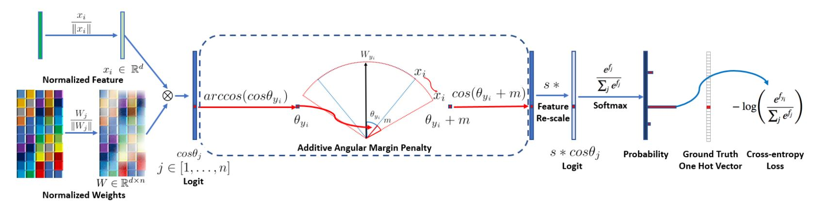

# [arcface-tf2](https://github.com/peteryuX/arcface-tf2)

[](https://lgtm.com/projects/g/peteryuX/arcface-tf2/context:python)


[](https://colab.research.google.com/github/peteryuX/arcface-tf2/blob/master/notebooks/colab-github-demo.ipynb)

:fire: ArcFace (Additive Angular Margin Loss for Deep Face Recognition, published in CVPR 2019) implemented in Tensorflow 2.0+. This is an unofficial implementation. :fire:

>  Additive Angular Margin Loss(ArcFace) has a clear geometric interpretation due to the exact correspondence to the geodesic distance on the hypersphere, and consistently outperforms the state-of-the-art and can be easily implemented with negligible computational overhead.

Original Paper: &nbsp; [Arxiv](https://arxiv.org/abs/1801.07698) &nbsp; [CVPR2019](http://openaccess.thecvf.com/content_CVPR_2019/html/Deng_ArcFace_Additive_Angular_Margin_Loss_for_Deep_Face_Recognition_CVPR_2019_paper.html)

Offical Implementation: &nbsp; [MXNet](https://github.com/deepinsight/insightface)



****

## Contents
:bookmark_tabs:

* [Installation](#Installation)
* [Data Preparing](#Data-Preparing)
* [Training and Testing](#Training-and-Testing)
* [Benchmark and Models](#Benchmark-and-Models)
* [References](#References)

## Installation
:pizza:

Create a new python virtual environment by [Anaconda](https://www.anaconda.com/) or just use pip in your python environment and then clone this repository as following.

### Clone this repo
```bash
git clone https://github.com/peteryuX/arcface-tf2.git
cd arcface-tf2
```

### Conda
```bash
conda env create -f environment.yml
conda activate arcface-tf2
```

### Pip

```bash
pip install -r requirements.txt
```

****

## Data Preparing
:beer:

All datasets used in this repository can be found from [face.evoLVe.PyTorch's Data-Zoo](https://github.com/ZhaoJ9014/face.evoLVe.PyTorch#Data-Zoo).

Note:

- Both training and testing dataset are "Align_112x112" version.

### Training Dataset

Download [MS-Celeb-1M](https://drive.google.com/file/d/1X202mvYe5tiXFhOx82z4rPiPogXD435i/view?usp=sharing) datasets, then extract and convert them to tfrecord as traning data as following.

```bash
# Binary Image: convert really slow, but loading faster when traning.
python data/convert_train_binary_tfrecord.py --dataset_path="/path/to/ms1m_align_112/imgs" --output_path="./data/ms1m_bin.tfrecord"

# Online Image Loading: convert really fast, but loading slower when training.
python data/convert_train_tfrecord.py --dataset_path="/path/to/ms1m_align_112/imgs" --output_path="./data/ms1m.tfrecord"
```

Note:
- You can run `python ./dataset_checker.py` to check if the dataloader work.

### Testing Dataset

Download [LFW](https://drive.google.com/file/d/1WO5Meh_yAau00Gm2Rz2Pc0SRldLQYigT/view?usp=sharing), [Aged30](https://drive.google.com/file/d/1AoZrZfym5ZhdTyKSxD0qxa7Xrp2Q1ftp/view?usp=sharing) and [CFP-FP](https://drive.google.com/file/d/1-sDn79lTegXRNhFuRnIRsgdU88cBfW6V/view?usp=sharing) datasets, then extract them to `/your/path/to/test_dataset`. These testing data are already binary files, so it's not necessary to do any preprocessing. The directory structure should be like bellow.
```
/your/path/to/test_dataset/
    -> lfw_align_112/lfw
        -> data/
        -> meta/
        -> ...
    -> agedb_align_112/agedb_30
        -> ...
    -> cfp_align_112/cfp_fp
        -> ...
```

****

## Training and Testing
:lollipop:

You can modify your own dataset path or other settings of model in [./configs/*.yaml](https://github.com/peteryuX/arcface-tf2/tree/master/configs) for training and testing, which like below.

```python
# general (shared both in training and testing)
batch_size: 128
input_size: 112
embd_shape: 512
sub_name: 'arc_res50'
backbone_type: 'ResNet50' # or 'MobileNetV2'
head_type: ArcHead # or 'NormHead': FC to targets.
is_ccrop: False # central-cropping or not

# train
train_dataset: './data/ms1m_bin.tfrecord' # or './data/ms1m.tfrecord'
binary_img: True # False if dataset is online decoding
num_classes: 85742
num_samples: 5822653
epochs: 5
base_lr: 0.01
w_decay: !!float 5e-4
save_steps: 1000

# test
test_dataset: '/your/path/to/test_dataset'
```

Note:
- The `sub_name` is the name of outputs directory used in checkpoints and logs folder. (make sure of setting it unique to other models)
- The `head_type` is used to choose [ArcFace](https://arxiv.org/abs/1801.07698) head or normal fully connected layer head for classification in training. (see more detail in [./modules/models.py](https://github.com/peteryuX/arcface-tf2/blob/master/modules/models.py#L90-L94))
- The `is_ccrop` means doing central-cropping on both trainging and testing data or not.
- The `binary_img` is used to choose the type of training data, which should be according to the data type you created in the [Data-Preparing](#Data-Preparing).


### Training

Here have two modes for training your model, which should be perform the same results at the end.
```bash
# traning with tf.GradientTape(), great for debugging.
python train.py --mode="eager_tf" --cfg_path="./configs/arc_res50.yaml"

# training with model.fit().
python train.py --mode="fit" --cfg_path="./configs/arc_res50.yaml"
```

### Testing

You can download my trained models for testing from [Benchmark and Models](#Benchmark-and-Models) without training it yourself. And, evaluate the models you got with the corresponding cfg file on the testing dataset. The testing code in [./modules/evaluations.py](https://github.com/peteryuX/arcface-tf2/blob/master/modules/evaluations.py) were modified from [face.evoLVe](https://github.com/ZhaoJ9014/face.evoLVe.PyTorch).

```bash
python test.py --cfg_path="./configs/arc_res50.yaml"
```

### Encode Input Image

You can also encode image into latent vector by model. For example, encode the image from [./data/BruceLee.jpg](https://github.com/peteryuX/arcface-tf2/blob/master/data/BruceLee.jpg) and save to `./output_embeds.npy` as following.

```bash
python test.py --cfg_path="./configs/arc_res50.yaml" --img_path="./data/BruceLee.jpg"
```

****

## Benchmark and Models
:coffee:

Verification results (%) of different backbone, head tpye, data augmentation and loss function.

| Backbone | Head | Loss | CCrop | LFW | AgeDB-30 | CFP-FP | Download Link |
|----------|------|------|-------|-----|--------|----------|---------------|
| [ResNet50](https://arxiv.org/abs/1512.03385) | [ArcFace](https://arxiv.org/abs/1801.07698) | Softmax | False | 99.35 | 95.03  |  90.36   | [GoogleDrive](https://drive.google.com/file/d/1HasWQb86s4xSYy36YbmhRELg9LBmvhvt/view?usp=sharing) |
| [MobileNetV2](https://arxiv.org/abs/1801.04381) | [ArcFace](https://arxiv.org/abs/1801.07698) | Softmax | False | 98.67 | 90.87  |  88.51   | [GoogleDrive](https://drive.google.com/file/d/1qG8BChcPHzKuGwjJhrpeIxBqQmhpLvTX/view?usp=sharing) |
| [ResNet50](https://arxiv.org/abs/1512.03385) | [ArcFace](https://arxiv.org/abs/1801.07698) | Softmax | True | 99.28 | 94.82 | 93.14 | [GoogleDrive](https://drive.google.com/file/d/1zUulC-4hSY_kPqZpcoIHO96OmjMivuKB/view?usp=sharing) |
| [MobileNetV2](https://arxiv.org/abs/1801.04381) | [ArcFace](https://arxiv.org/abs/1801.07698) | Softmax | True | 98.50 | 91.43 | 89.44 | [GoogleDrive](https://drive.google.com/file/d/1nSnIc0eV0MkSjg48x29PJwTt3fGXKDU4/view?usp=sharing) |

Note:
- The 'CCrop' tag above means doing central-cropping on both trainging and testing data, which could eliminate the redundant boundary of intput face data (especially for AgeDB-30).
- All training settings of the models can be found in the corresponding [./configs/*.yaml](https://github.com/peteryuX/arcface-tf2/tree/master/configs) files.

****

## References
:hamburger:

Thanks for these source codes porviding me with knowledges to complete this repository.

- https://github.com/deepinsight/insightface (Official)
    - Face Analysis Project on MXNet http://insightface.ai
- https://github.com/zzh8829/yolov3-tf2
    - YoloV3 Implemented in TensorFlow 2.0
- https://github.com/ZhaoJ9014/face.evoLVe.PyTorch
    - face.evoLVe: High-Performance Face Recognition Library based on PyTorch
- https://github.com/luckycallor/InsightFace-tensorflow
    - Tensoflow implementation of InsightFace (ArcFace: Additive Angular Margin Loss for Deep Face Recognition).
- https://github.com/dmonterom/face_recognition_TF2
    - Training a face Recognizer using ResNet50 + ArcFace in TensorFlow 2.0
